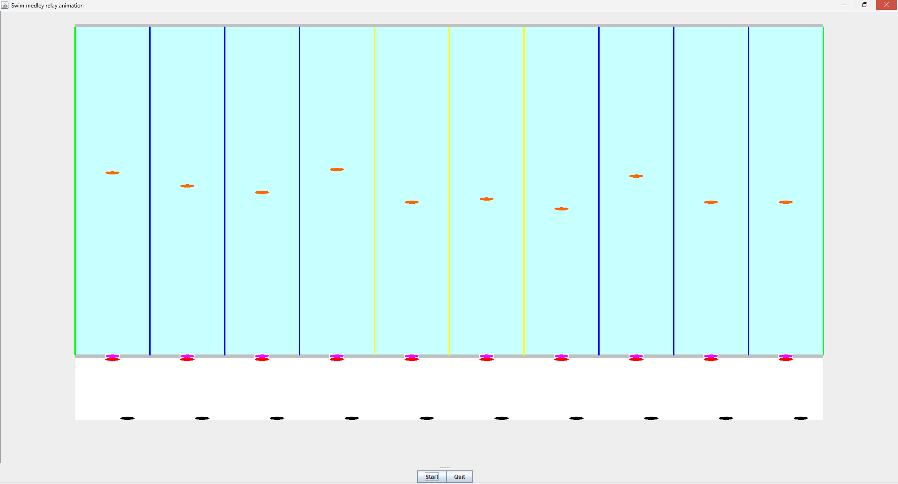

# **Medley simulation**
The assignment entails producing a Java simulation of 10 teams of four swimmers taking part 
in a relay race, ensuring that it follows defined behavioral rules. 
In this simulation, the stadium is represented as a grid of a specified size, containing an pool, 
an entrance door, a starting line and a free area.
The simulation begins when the user presses the Start button.
Swimmers then enter through the entrance door one by one in the order of their swim stoke, 
proceed to line up at the starting block, then swim their 100m of the the race as a relay 
(swimmers start only after their previous teammate has finished): each swimmer swims to the 
end of the 50m pool and back. Once they have finished their 100m, swimmers exit the pool 
and stand at the back of the stadium, except for the last member of the team, who stays in the 
pool once done. 
